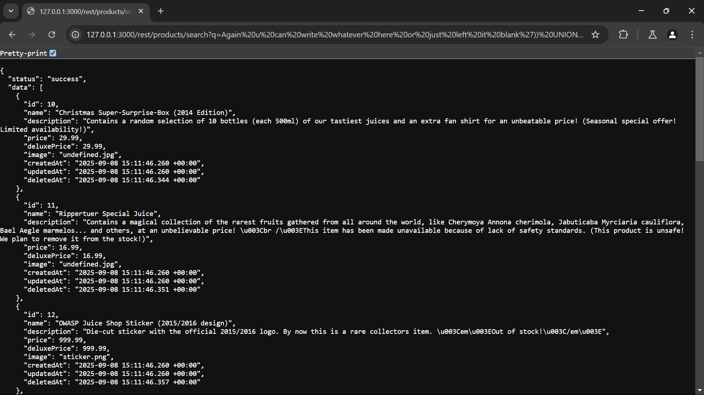
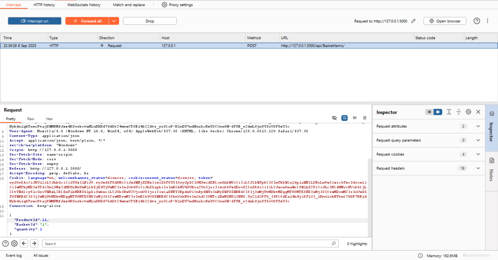
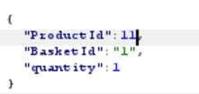
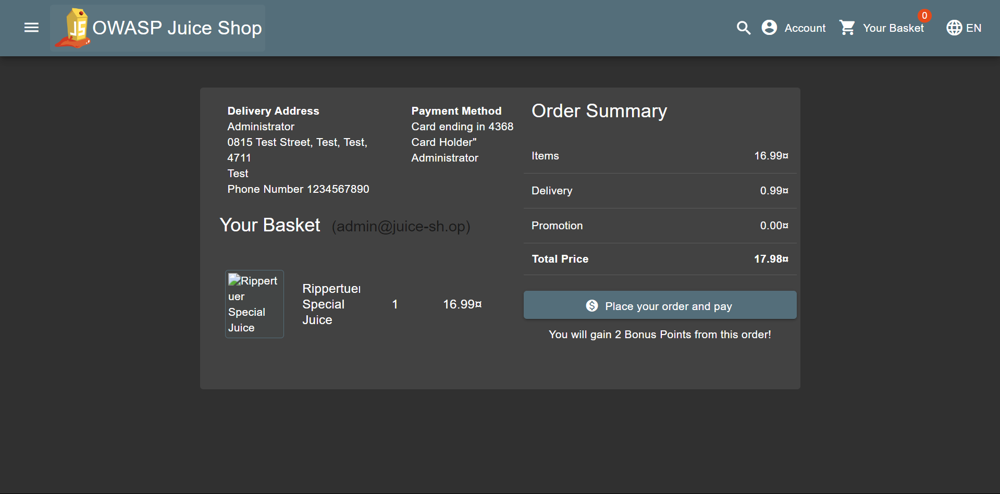
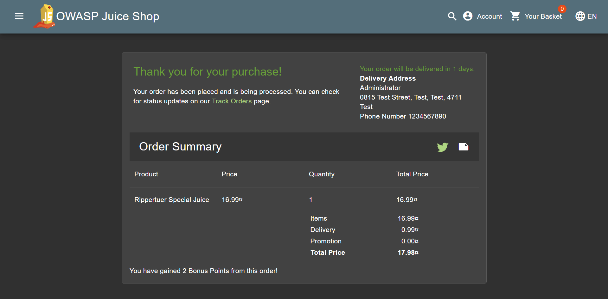

# Christmas Special Write-Up
> **Source:** https://juice-shop.herokuapp.com/#/score-board?categories=Injection

## Overview

**Title:** Christmas Special

**Category:** Injection

The goal of this challenge was to use a SQL Injection to access a special Christmas product. This item was hidden from the main product list because it was marked as `deleted` in the database.

## Solution

### 1. Using the Product Search Function

> As we tried earlier on in the Database Schema Challenge, the search functionality on `127.0.0.1:3000/rest/products/search?q=` was identified as an SQL injection point, similar to previous challenges involving user data extraction.

### 2. Exploiting the Search Feature by Crafting SQL Injection Query

> We also found out before that the database schema had a deletedAt collumns, therefore we can initiate an SQL injection with the query `Again u can write whatever here or just left it blank')) UNION SELECT * FROM PRODUCTS WHERE deletedAt IS NOT NULL--`.

### 3. Extracting Hidden Product Details

> The SQL Injection successfully returned details of products that were not visible in the regular product listings, which include the Christmas offer.

### 4. Manipulating the Cart to Add the Product

> Add a product in shopping cart and capture request using Burp, Then we can add to the shopping cart the special product by setting the `ProductId` to `11` in the `POST` request

### 5. Checking out The cart

> Lastly, checkout the cart by simply pressing checkout and it will solve the challenge

## Solution Explanation

The solution was to exploit a SQL injection in the product search feature. We crafted a query to specifically look for products marked as `deleted`, in which means where `deletedAt` was not null. This made the hidden Christmas item appear. After finding its productId through the injection, we bypassed the standard user interface by directly sending a request to add that specific product to the cart.