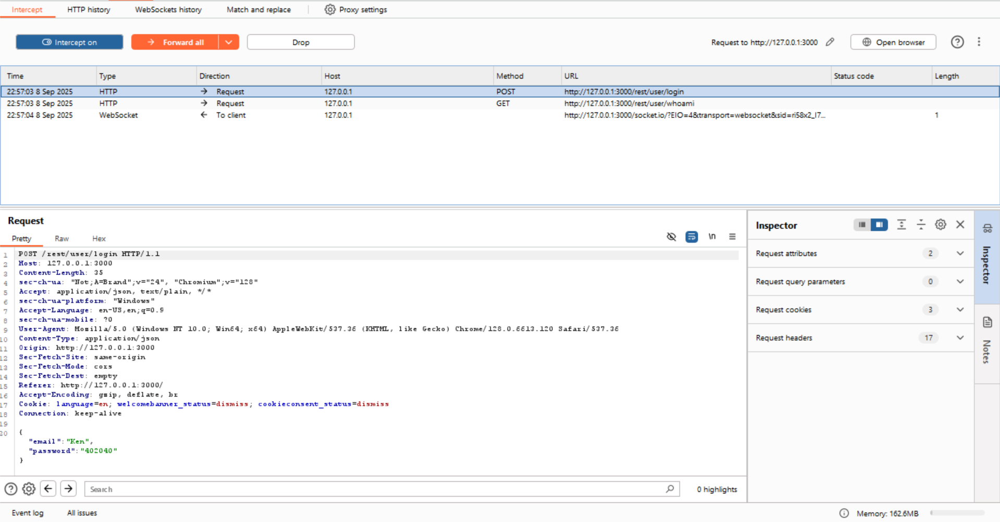
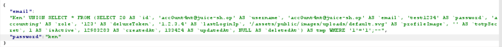
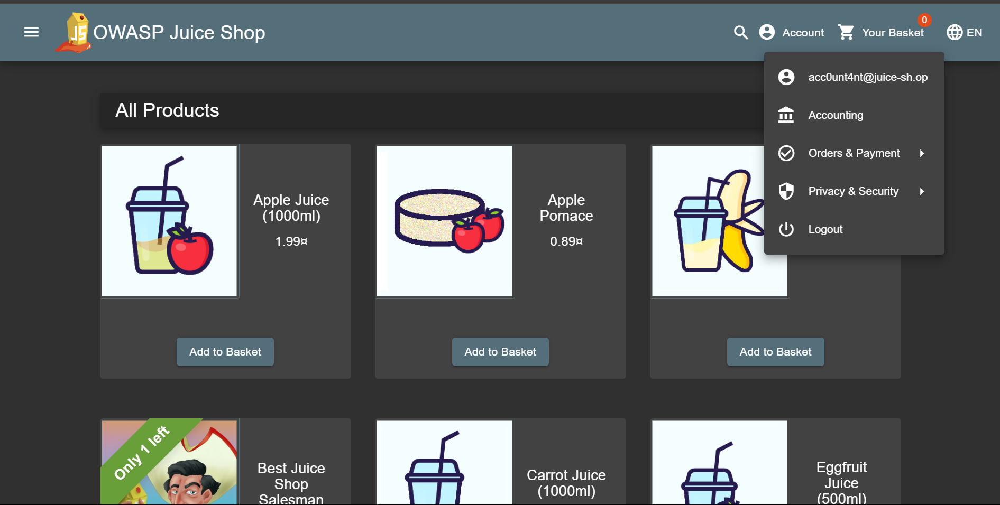

# Ephemeral Accountant Write-Up
> **Source:** https://juice-shop.herokuapp.com/#/score-board?categories=Injection

## Overview

**Title:** Ephemeral Accountant 

**Category:** Injection

This challenge involves using SQL injection to simulate the login of a non-existent but temporarily created user "acc0unt4nt@juice-sh.op" without actually adding the account to the database permanently.

## Solution

### 1. Analyzing the Login Functionality
> Captured the typical HTTP POST request used for logging in which looks something like this


### 2. Crafting the SQL Injection Payload
> Since the challenge prevents creating a real account or permanently changing the database, I used a `UNION SELECT` SQL injection. This technique creates a temporary, fake user account that exists only for the moment the login query is running, tricking the system into granting access without saving any new data

### 3. Injecting the Temporary User in the SQL Query
> Crafting the query as a key to construct a subquery within the `UNION SELECT` that mimics a legitimate user record. The query can be seen as below:

```
{
    "email": "Ken' UNION SELECT * FROM (SELECT 20 AS `id`, 'acc0unt4nt@juice-sh.op' AS `username`, 'acc0unt4nt@juice-sh.op' AS `email`, 'test1234' AS `password`, 'accounting' AS `role`, '123' AS `deluxeToken`, '1.2.3.4' AS `lastLoginIp`, '/assets/public/images/uploads/default.svg' AS `profileImage`, '' AS `totpSecret`, 1 AS `isActive`, 12983283 AS `createdAt`, 133424 AS `updatedAt`, NULL AS `deletedAt`) AS tmp WHERE '1'='1';--"
    "password": "ken"
}
```





## Solution Explanation

This SQL injection uses `UNION SELECT` to add a temporary, fake user to the results of the login query. We build a complete user record from scratch, making sure it has all the same columns, like `id`, `email`, `password` as a real user. 

This makes the fake user look legitimate to the application. The `WHERE '1'='1'` part is a simple trick to ensure our fake user is always returned, and the `--` at the end comments out the rest of the original query to prevent errors. As a result, the application finds our 'ephemeral' user in the database results and logs us in, even though the account doesn't actually exist.