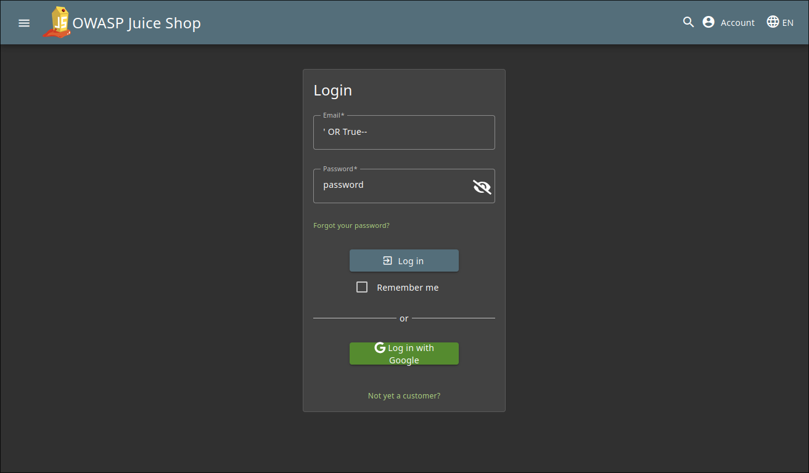

# **Login Admin Write-Up**
> **Sumber Soal:** https://juice-shop.herokuapp.com/#/score-board?categories=Injection
## Penjelasan Soal

**Judul:** Login Admin

**Kategori:** Injection

Tujuan Dari Tutorial ini adalah untuk masuk menggunakan Akun Admin

## **Langkah-Langkah**

### 1. Masuk ke Dalam Login Page

### 2. Tuliskan skrip `' OR True--` ke Dalam Field Email
> Untuk field passwordnya, bisa dituliskan apa saja seperti berikut

 

### 3. Klik `Login` untuk Masuk ke Dalam Akun

## Penjelasan Solusi

Serangan SQL Injection berhasil karena input tidak divalidasi dengan baik dan query tidak menggunakan parameter. Payload seperti `' OR True--` mengubah kondisi pada `WHERE` menjadi selalu benar, lalu menjadikan sisa query menjadi komentar sehingga pengecekan password diabaikan. Alurnya dapat dilihat di bawah ini:

- Tanda `'` menutup string email.
- `OR True` membuat kondisi bernilai benar untuk semua baris.
- `--` mengubah bagian akhir query menjadi sebuah komentar, termasuk verifikasi password.

Akibatnya, penyerang bisa melewati authentication dan dapat masuk sebagai pengguna pertama, yang biasanya adalah user Admin.
