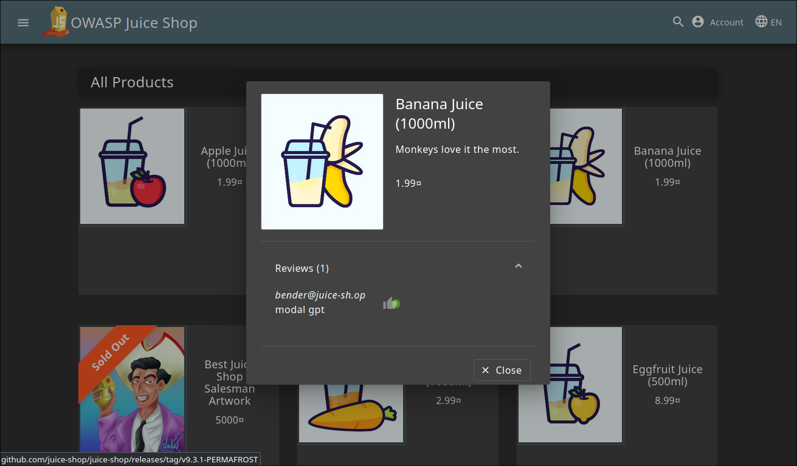
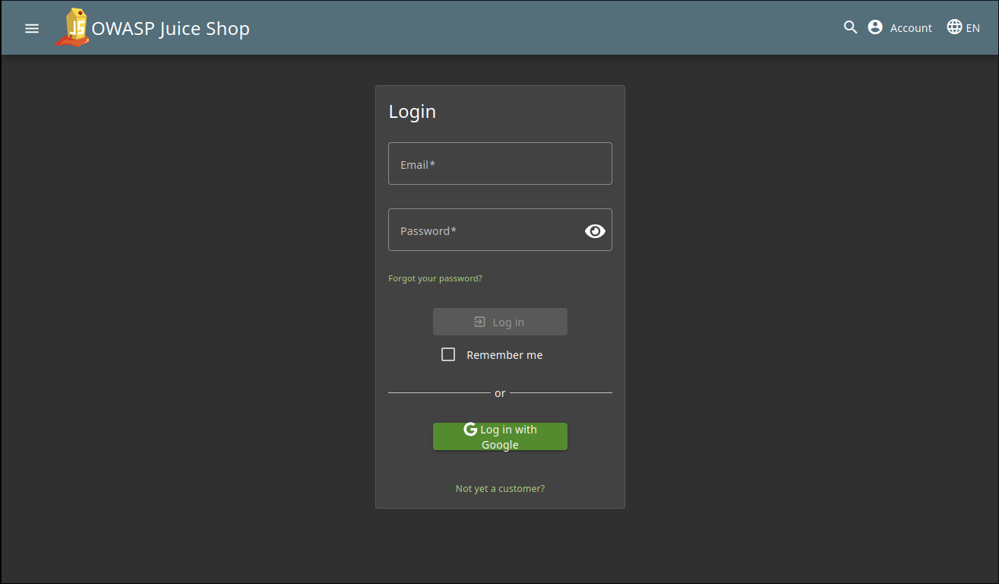
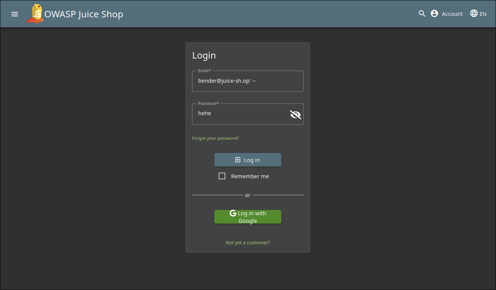
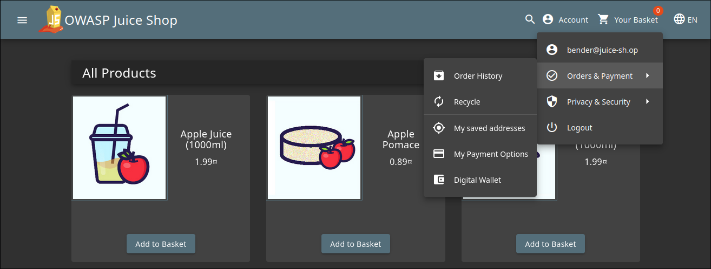

# **Login Bender Write-Up**
> **Sumber Soal:** https://juice-shop.herokuapp.com/#/score-board?categories=Injection

## Penjelasan

**Judul:** Login Bender

**Kategori:** Injection

Tujuan Dari Tutorial ini adalah untuk masuk menggunakan Akun milik Bender

## **Langkah-Langkah**

### 1. Cari Email yang digunakan oleh Bender melalui Review

### 2. Masuk ke Dalam Login Page

### 3. Masukkan Email dan Password seperti di Bawah
> Dalam kasus ini, password dapat diisi dengan apa saja, karena tidak akan terbaca

> Setelah Login

## Penjelasan Solusi
Dalam kasus ini, kita memanfaatkan celah dalam SQL Injection yang sering terjadi pada field email di form login. Aplikasi menyusun query seperti di bawah ini:  
`SELECT * FROM Users WHERE email = '<input>' AND password = '<input/hashed>'`

Dengan memanfaatkan query tersebut, kita bisa tambahkan tanda `'` dan `--`, yang artinya menutup string email dan mengubah query sisanya menjadi sebuah komentar. Dengan mengubah query sisa menjadi sebuah komentar, otomatis query untuk pengecekan password akhirnya akan tidak terbaca dan terlewati.
