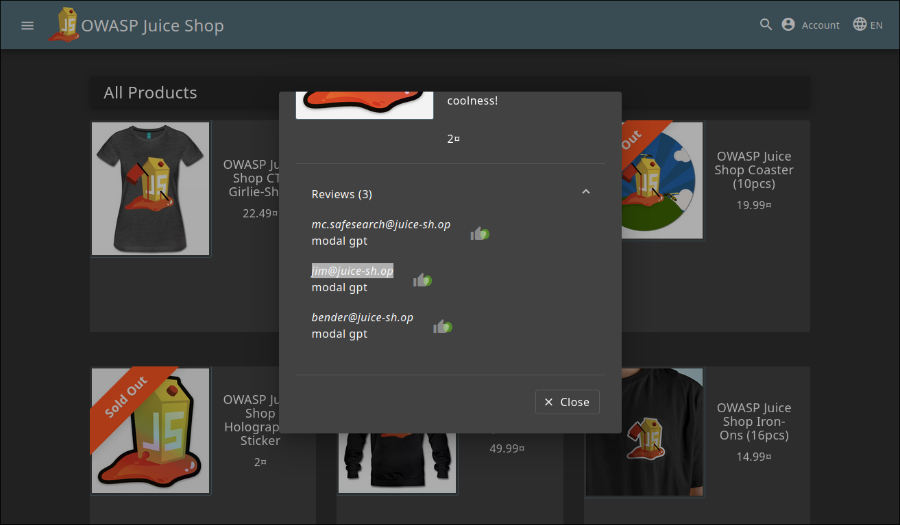
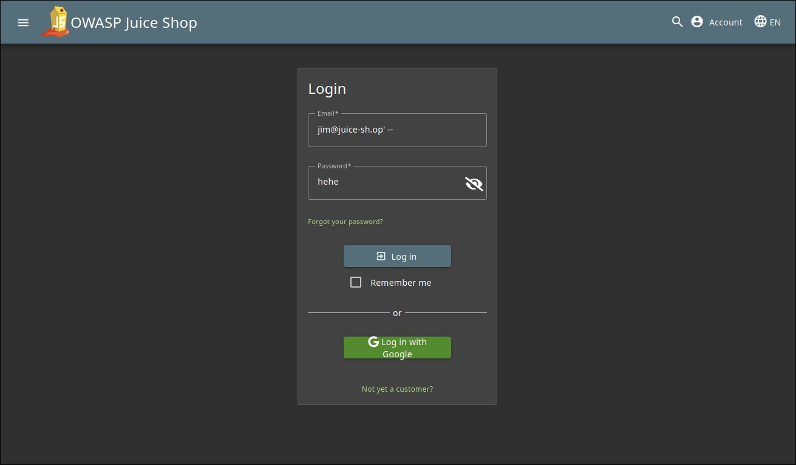
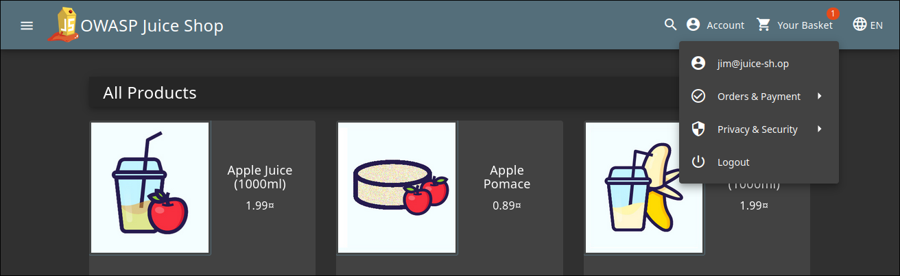

# **Login Jim Write-Up**
> **Sumber Soal:** https://juice-shop.herokuapp.com/#/score-board?categories=Injection

## Penjelasan

**Judul:** Login Jim

**Kategori:** Injection

Tujuan Dari Tutorial ini adalah untuk masuk menggunakan Akun milik Jim

## **Langkah-Langkah**

### 1. Cari Email yang digunakan oleh Jim melalui Review
 

### 2. Masukkan Email dan Password seperti di Bawah
> Sama seperti kasus Login Bender, password dapat diisi dengan apa saja, karena tidak akan terbaca

 

> Setelah Login

## Penjelasan Solusi
Dalam kasus ini, sama seperti kasus login Bender, kita memanfaatkan celah dalam SQL Injection yang sering terjadi pada field email di form login. Aplikasi menyusun query seperti di bawah ini:  
`SELECT * FROM Users WHERE email = '<input>' AND password = '<input/hashed>'`

Dengan memanfaatkan query tersebut, kita bisa tambahkan tanda `'` dan `--`, yang artinya menutup string email dan mengubah query sisanya menjadi sebuah komentar. Dengan mengubah query sisa menjadi sebuah komentar, otomatis query untuk pengecekan password akhirnya akan tidak terbaca dan terlewati.