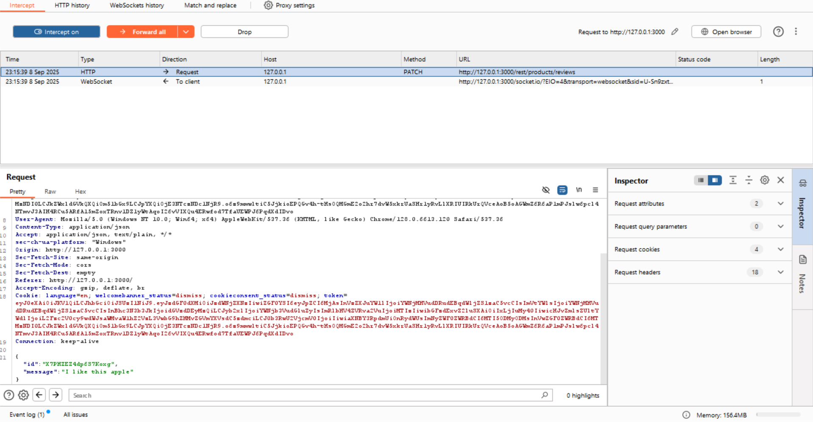
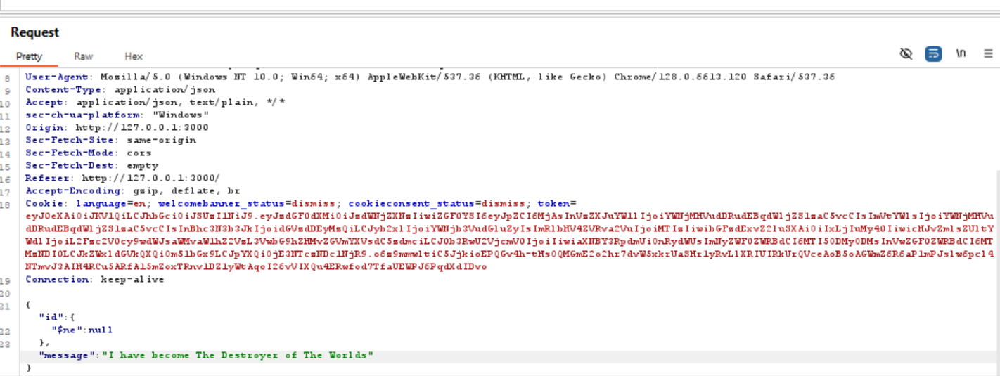
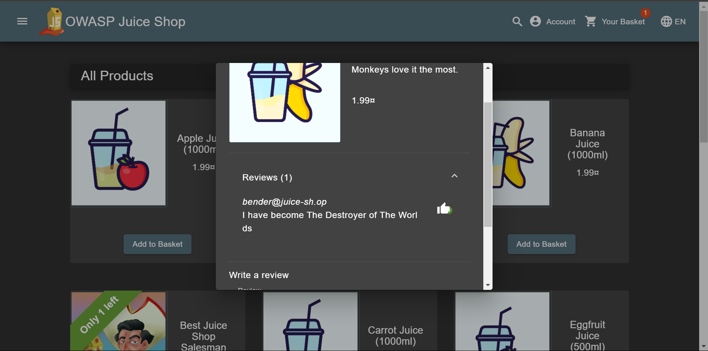

# NoSQL Manipulation Write-Up
> **Source:** https://juice-shop.herokuapp.com/#/score-board?categories=Injection

## Overview

**Title:** NoSQL Manipulation

**Category:** Injection

This challenge involves exploiting a NoSQL injection vulnerability to update multiple product reviews at the same time in a NoSQL database.

## Solution

### 1. Analyzing the Normal Update Request
> Captured a normal HTTP PATCH request by using Burp Suite. This request meant for updating a single product review.

````json
{
  "id": "specific_review_id",
  "message": "updated_review_text"
}
````



### 2. Crafting the NoSQL Injection Payload
> The goal was to update multiple reviews in the same time by exploiting a NoSQL injection. The key was to manipulate the `id` parameter in the JSON payload. Since the backend uses a NoSQL database like MongoDB, we can use its special operators. I used the `$ne` (not equal) operator. By sending `{"$ne": null}` as the ID, the query essentially becomes "update all reviews where the ID is not equal to null." Since every review has an ID, this condition matches all of them, allowing a single request to modify every review.

### 3. Sending the Modified Request
> The `POST` payload would look like this by modifying the request to include the injection in the id field
````json
{
  "id": {
    "$ne": null
  },
  "message": "PWNED"
}
````



By sending this request, the server processed it as a valid query, updating all reviews to have the same message due to the condition applied through NoSQL injection.



## Solution Explanation

The solution was to use a NoSQL injection to change all product reviews at once. By sending `{"$ne": null}` as the review ID, we tricked the database into updating every review because the condition 'ID is not equal to null' is true for all of them. This bypassed the normal function of updating a single review and resulted in an unauthorized bulk update.

This vulnerability happened because the application directly uses user input in its database queries without cleaning or validating it first. This is a common security flaw, especially in applications using NoSQL databases like MongoDB, as it allows attackers to inject database operators and manipulate queries.