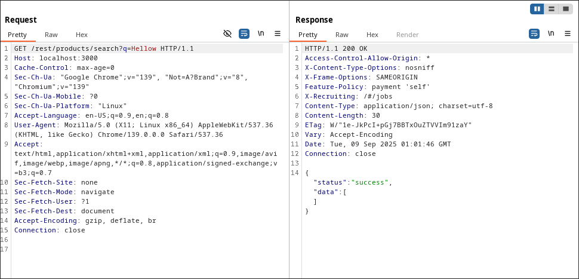
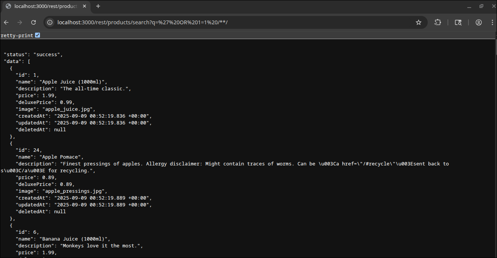
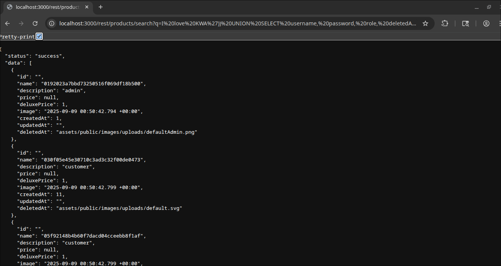

# User Credentials Write-Up
> **Source:** https://juice-shop.herokuapp.com/#/score-board?categories=Injection

## Overview

**Title:** User Credentials

**Category:** Injection

This challenge was about exploiting an SQL Injection vulnerability to extract sensitive user credentials from the application's database.

## Solution

### 1. Identifying the Injection Point
> At first, I tried the login form again, but then i remember that we have this endpoint, which is used to interact with the database

### 2. Exploiting the Search Feature
> As we learned from the other challenges, the search endpoint can be abused by adding `'` and then some SQL query, just like this one `' OR 1=1 /**/`

### 3. Crafting the SQL Payload
> A basic union query was attempted to retrieve data from the `USERS` table, using `Try this' UNION SELECT * FROM USERS /**/.` This resulted in an error indicating a mismatch in the number of columns. Through more experimentation, the correct number of columns was determined, and the query was refined to: `I love KWA')) UNION SELECT username, password, role, deletedAt, isActive, createdAt, id, deluxeToken, profileImage FROM USERS--`

## Solution Explanation

This challenge was resolved by leveraging a SQL Injection vulnerability identified in the product search API endpoint. The exploit methodology involved a `UNION`-based SQL injection attack, which combines the result set of the original search query with a malicious query designed to retrieve data from other database tables.

The process began by confirming the vulnerability and then determining the correct number of columns returned by the legitimate query. This was necessary to craft a valid `UNION SELECT` statement. Once the column structure was ascertained, a payload was constructed to target the `USERS` table, successfully exfiltrating sensitive user credentials, including usernames and passwords, directly from the database.