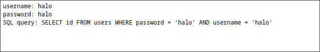
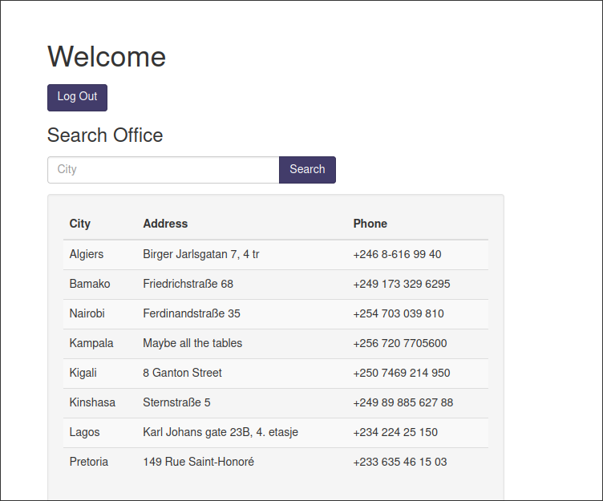
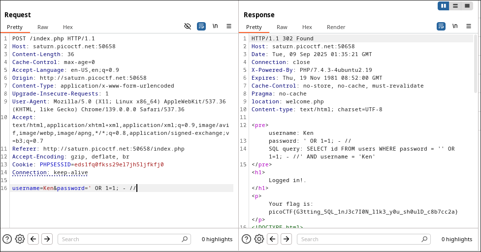

# More SQLi Write-Up
> **Source:** https://picoctf.org/

## Overview

**Title:** More SQLi

**Category:** Injection, Web Exploitation

This challenge involved a login page that appeared to be vulnerable to SQL injection (SQLi). The goal was to exploit this vulnerability to bypass authentication and retrieve the flag.

## Solution

### 1. Exploring the Login Page
I started by entering simple credentials:
````shell
Username: halo
Password: halo
````
After submitting, the response revealed a SQL query structure
`SQL query: SELECT id FROM users WHERE password = 'halo' AND username = 'halo'`



Seeing the raw SQL query in the response confirmed that the application was directly embedding user input into the query, making it vulnerable to SQL injection.

### 2. Injecting SQL Code
> Knowing that `1=1` always evaluates to true, I tried using `' OR 1=1; - //` payload in both the username and password fields, to modify the query to `SELECT id FROM users WHERE password = ' ' OR 1=1 ; -- // ' AND username = 'Ken'`. Since `1=1` is always true, the query would return a valid user, allowing me to bypass authentication successfully.



### 3. Trying it in Burp Suite
> Because I didn't found the flag, i tried to do it through Burp Suite, therefore finding the flag by sending the payload



**The Flag:** 
````shell
picoCTF{G3tting_5QL_1nJ3c7I0N_l1k3_y0u_sh0ulD_c8b7cc2a}
````

## Solution Explanation

This challenge was solved by exploiting a classic SQL injection vulnerability, which was evident because the application failed to sanitize user input and exposed the raw SQL query in its response. The authentication was bypassed using the payload `' OR 1=1; - //`, which closes the password string, appends a universally true condition, and comments out the remainder of the query, thus always granting access. While this could be attempted in a browser, using a tool like Burp Suite to intercept and modify the login request provided a more effective method to inject the payload and successfully retrieve the flag from the server's response.