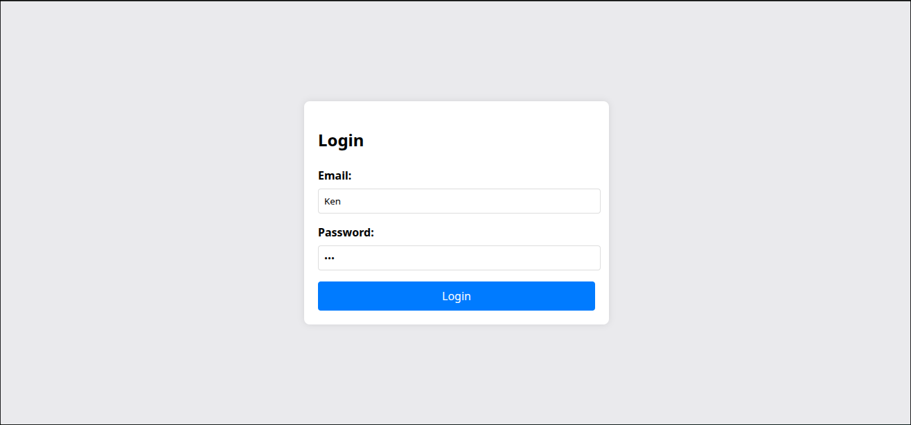
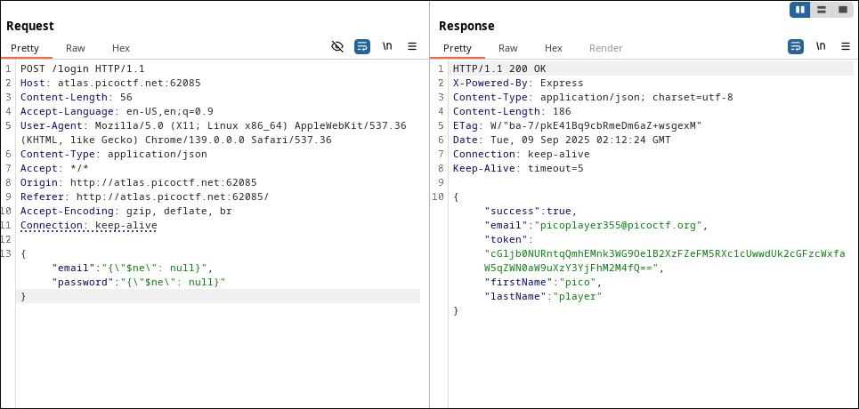
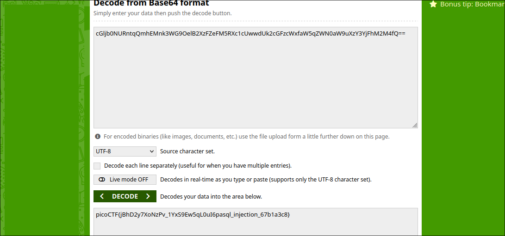

# No SQL Injection Write-Up
> **Source:** https://picoctf.org/

## Overview

**Title:** No SQL Injection

**Category:** Injection, Web Exploitation

The challenge provides a web application with a login endpoint. The server is built using Express.js and uses MongoDB to store user data. The goal is to bypass authentication and retrieve a sensitive token that contains the flag. 

## Solution

### 1. Researching MongoDB Exploits
> A common NoSQL authentication bypass technique involves using `{ “$ne”: null }`, which means “not equal to null.” This can often trick MongoDB into returning a valid user without knowing their credentials.



### 2. Crafting the Payload
> Initially, I went to Burp Suite and Intercept the request. Therefore, crafting the following payload for the login fields. I tried using a simpler version, like 
`{ “$ne”: null }` for both username and password in the login page directly.



### 3. Extracting the Flag
> The response returned user details, including a token. This looked like a Base64-encoded string, so I copied it and used online Base 64 decoder to decode it




**The Flag:** 
```shell
picoCTF{jBhD2y7XoNzPv_1YxS9Ew5qL0uI6pasql_injection_67b1a3c8}
```

## Solution Explanation

This challenge was solved by exploiting a NoSQL injection vulnerability in the login functionality. The application, which uses MongoDB, was susceptible to query operator injection. Instead of providing a plain string for the username and password, a JSON object containing a MongoDB operator was sent using Burp Suite. Specifically, the payload `{"username": {"$ne": null}, "password": {"$ne": null}}` was used. This payload alters the database query to search for any user where the `username` and `password` fields are 'not equal to' (`$ne`) `null`. This condition matches the first user in the database, effectively bypassing the authentication check. The server responded with a successful login, providing a Base64 encoded token which, when decoded, revealed the flag.