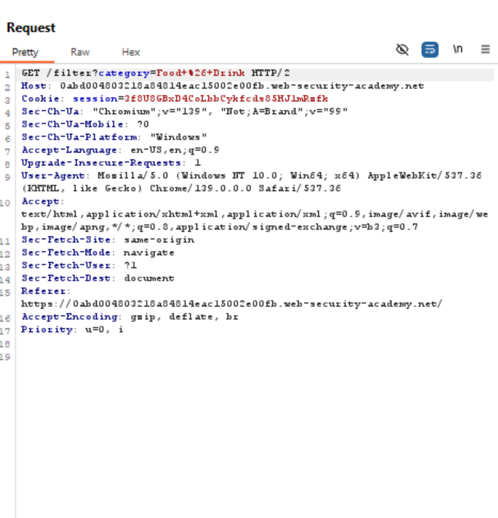
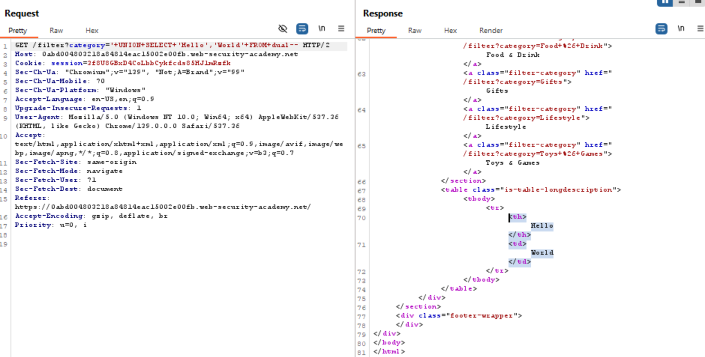
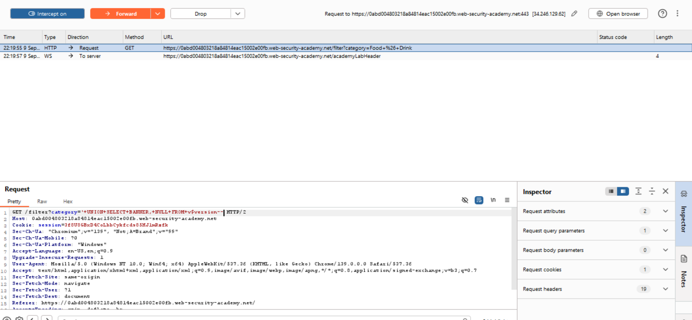
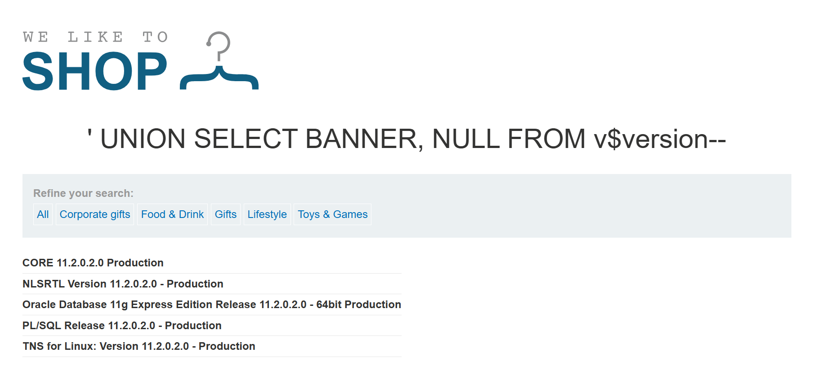

# SQL injection attack, querying the database type and version on Oracle Write Up

>**Source:** https://portswigger.net/web-security/sql-injection/examining-the-database/lab-querying-database-version-oracle

**Title:** SQL injection attack, querying the database type and version on Oracle

**Category:** Injection, Web Exploitation

This lab contains a SQL injection vulnerability in the product category filter. You can use a UNION attack to retrieve the results from an injected query.

## Solution

### 1. Use Burp Suite to intercept and modify the request that sets the product `category` filter.

### 2. Identify the Payload and Verify that the query is Returning the Data in Collumns

> We can use this payload  `'+UNION+SELECT+'Hello','World'+FROM+dual--` to check whether the database has 2 collumns or not

And sure enough it's returning 2 collumns

### 3. Sending the Payload for Version Check

> We can also use this payload from the Cheatsheet to check the version , such as `'+UNION+SELECT+BANNER,+NULL+FROM+v$version--`

And with that, the Lab is completed

## Solution Explanation

This solution exploits a `UNION`-based SQL injection in the product category filter. The first step was to determine the number of columns in the original query by injecting a `UNION SELECT` statement with a known number of values from Oracle's built-in `dual` table. After confirming the query returns two columns, a second payload, `'+UNION+SELECT+BANNER,+NULL+FROM+v$version--`, was used. This payload queries the Oracle-specific `v$version` view to retrieve the database version information from the `BANNER` column, using `NULL` to fill the second column to match the original query's structure. The `--` comment at the end neutralizes the rest of the original SQL, causing the application to return the database version information in the product list.