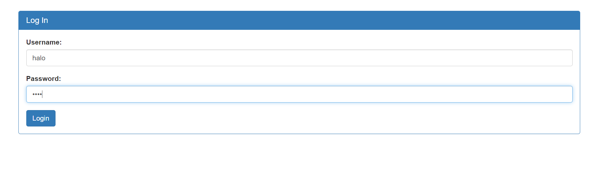
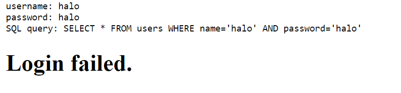
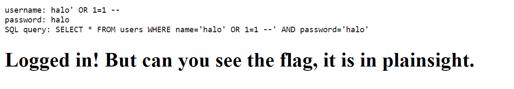
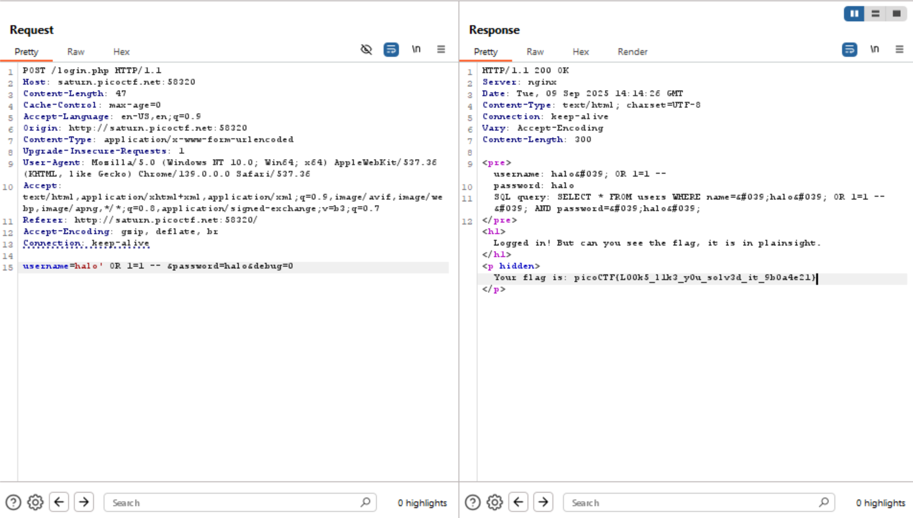

# SQLiLite Injection Write-Up
> **Source:** https://picoctf.org/

## Overview

**Title:** SQLiLite Injection

**Category:** Injection, Web Exploitation

This challenge involved a login page that appeared to be vulnerable to SQL injection (SQLi). The goal was to exploit this vulnerability to bypass authentication and retrieve the flag.

## Solution

### 1. Exploring the Login Page
I started by entering simple credentials:
````shell
Username: halo
Password: halo
````
After submitting, the response revealed a SQL query structure
`SQL query: SELECT * FROM users WHERE name='halo' AND password='halo'`




Seeing the raw SQL query in the response confirmed that the application was directly embedding user input into the query, making it vulnerable to SQL injection

### 2. Crafting and Injecting SQL Code
> Knowing that `1=1` always evaluates to true, I tried using `' OR 1=1; - //` payload in both the username and password fields, to modify the query to `SQL query: SELECT * FROM users WHERE name='halo' OR 1=1 -- AND password='halo'`. Since `1=1` is always true, the query would return a valid user, allowing me to bypass authentication successfully.



### 3. Trying it in Burp Suite
> Because I didn't found the flag, i tried to do it through Burp Suite, in which finding the flag by sending the payload



**The Flag:** 
````shell
picoCTF{L00k5_l1k3_y0u_solv3d_it_9b0a4e21}
````

## Solution Explanation

This solution exploits a classic SQL injection vulnerability discovered when the login page revealed its raw SQL query upon a failed login, confirming it directly used user input without sanitization. By injecting the payload `' OR 1=1 --` into the username field, the query was manipulated. The initial quote closes the username string, `OR 1=1` creates a condition that is always true, and the `--` comments out the rest of the original query, including the password check. This forced the database to return the first user record it found, successfully bypassing the authentication mechanism and displaying the flag.