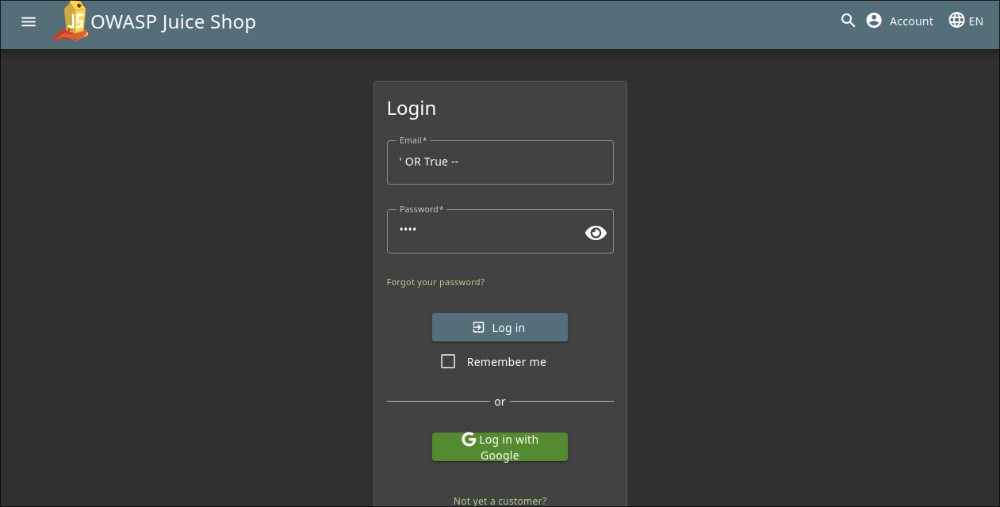
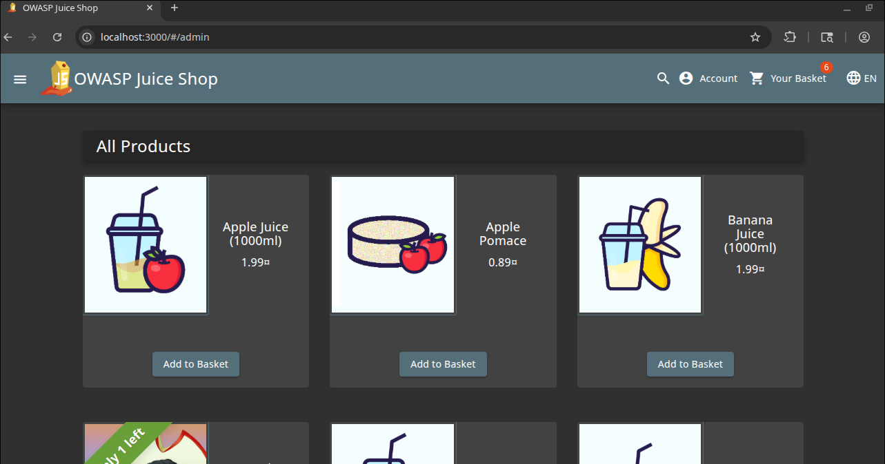
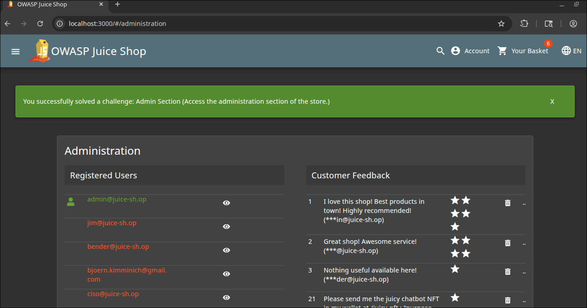

# Admin Session Write-Up
> **Source:** https://juice-shop.herokuapp.com/#/score-board?categories=Broken%20Access%20Control

## Overview

**Title:** Admin Session

**Category:** Broken Access Control

The "Admin Section" challenge involves accessing a restricted administrative area of a web application.

## Solution

### 1. Becoming the Admin
> In last week challenges, we have learnt how to log in as an `admin` by using SQL injection. In this challenge, we can use the same method to log in to the `admin` account

### 2. Finding the Admin Page
> By looking at the icons for the stack technologies that were used to build this web application, we could find it's administration page. We could try the most common one first, which is `admin`, `administration`, `wp-admin`

## Solution Explanation
The challenge was resolved by uncovering the hidden administrative path from guessing the administration path and then accessing it with an administrator's credentials. This shows a vulnerability in the application where sensitive areas are not adequately secured but merely hidden, assuming unauthorized users will not discover the path.

