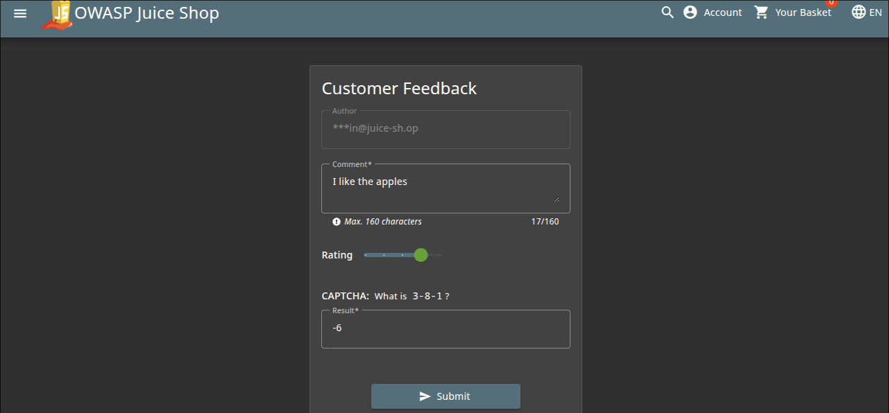

# Forged Feedback Write-Up
> **Source:** https://juice-shop.herokuapp.com/#/score-board?categories=Broken%20Access%20Control

## Overview

**Title:** Forged Feedback

**Category:** Broken Access Control

This challenge involves exploiting insufficient access controls to post feedback under another user's name, illustrating vulnerabilities related to user identity management within a web application.

## Solution

### 1. Understanding the Web's Feedback Mechanism
> Initially, submit feedback normally through the application's interface to understand how the feedback submission process works.

> Using Burp Suite, capture the HTTP request sent when feedback is submitted. Analyze the request to understand its structure and the parameters it includes.

  

### 2. Exploiting the Vulnerability
> Modify the "user_id" parameter in the intercepted request to the ID of another user, preferably a user with higher privileges like an admin, to test if the application enforces proper authorization checks.

> Resend the modified request to see if the feedback gets posted under the changed user ID.

## Solution Explanation
The challenge was successfully resolved by manipulating the user identifier in the feedback submission process. This was possible because the server failed to validate whether the user submitting the feedback was the same as the user ID specified in the request. This type of vulnerability is indicative of broken access control mechanisms where the application does not adequately verify the user's identity or permissions before performing actions on their behalf.