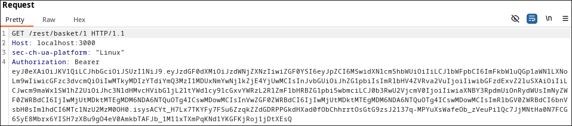
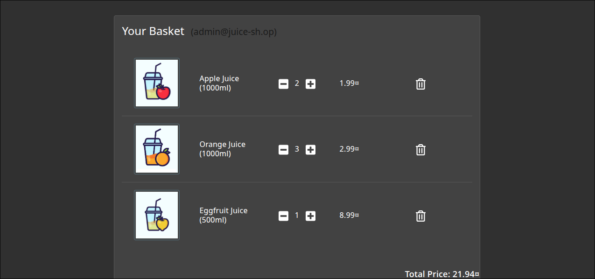
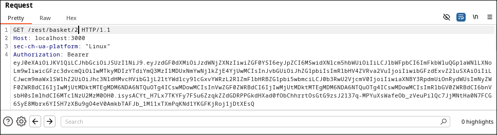
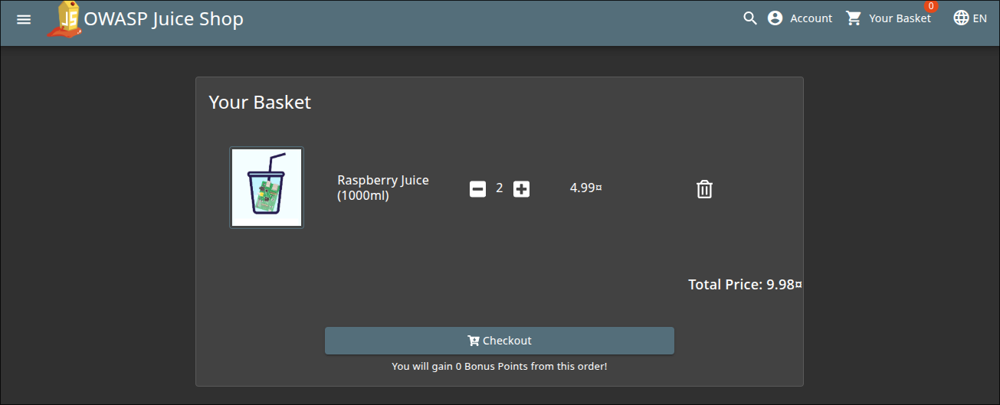

# View Basket Write-Up
> **Source:** https://juice-shop.herokuapp.com/#/score-board?categories=Broken%20Access%20Control

## Overview

**Title:** View Basket

**Category:** Broken Access Control

This challenge revolves around exploiting broken access control vulnerabilities within a web application. The specific vulnerability allows users to view the shopping basket details of other users by manipulating user-specific identifiers in web requests.

## Solution

### 1. Understanding the Vulnerability
> The web app allow users to see the content of their own shopping basket by fetching the basket details that includes a user-specific identifier, which in this case is the Basket ID. We can find this by intercepting the request using Burp Suite

 
 

We can see here that the identifier is located at the end of the endpoint, which is `1`

### 2. Modifying the Request
> Now that we know that the `1` in `/rest/basket/1` is the basket ID, we could try changing the ID from `1` to `2`

 

We can just foward the request and view the result just as shown below

### Solution Explanation
The challenge was successfully solved by changing the basket ID in the request URL, which should not have been possible if proper access control mechanisms were in place. This allowed access to another user's private basket information.

