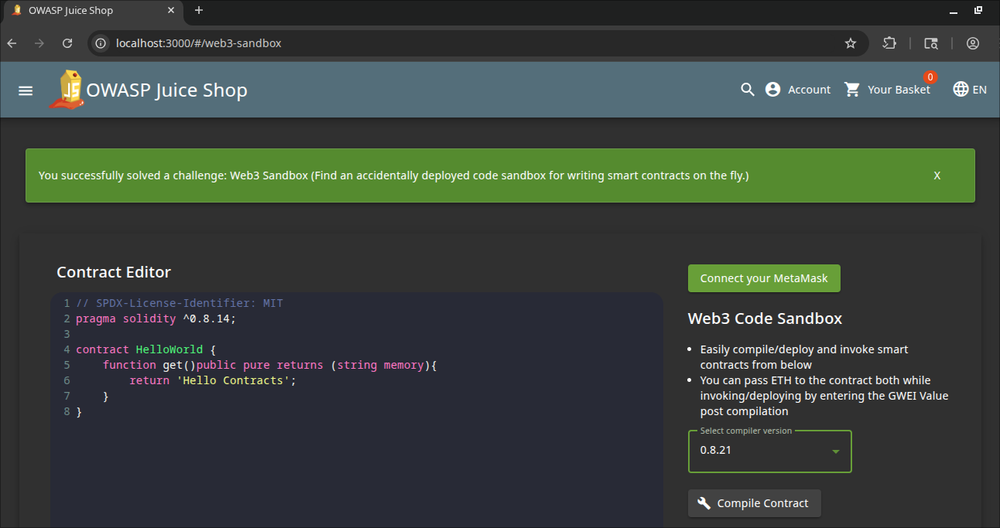

# Web3 Sandbox Write-Up
> **Source:** https://juice-shop.herokuapp.com/#/score-board?categories=Broken%20Access%20Control

## Overview

**Title:** Web3 Sandbox

**Category:** Broken Access Control

This challenge revolves around finding a hidden web3 sandbox webpage that was "accidently" deployed

## Solution

### 1. Finding the Location
> Initially, we could try the easiest guess to add `web3-sadbox` at the end of our URL.

And we found it, as easy as finding the score board

## Solution Explanation

This challenge exploited a typical security oversight where development tools or experimental features are inadvertently left accessible in production environments. Accessing the URL directly provided unrestricted access to powerful functionalities intended for controlled use, posing significant security risks.